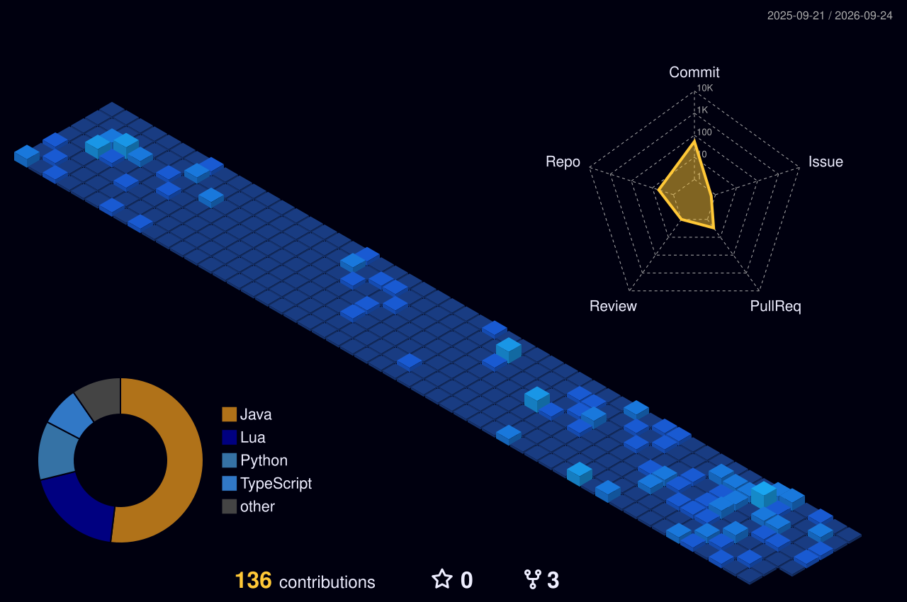

# Welcome
**Whoever loves discipline loves knowledge**

## About Me

-  Computer Science(UENF)
-  Electronics(IFF)
-  Learning Software Engineering

<!--
## Tecnologias e Ferramentas

## Featured Projects
- [**C-Algorithms**](https://github.com/MarcosBrun0/C-Algorithms): Data Structs and Sorting Algotimns for my Computer Science studies.
- [**Python-Studies**](https://github.com/MarcosBrun0/Python-Studies): Python Bootcamp exercises.

-->

### 🚀 Tools

<!--
**MarcosBrun0/MarcosBrun0** is a ✨ _special_ ✨ repository because its `README.md` (this file) appears on your GitHub profile.

Here are some ideas to get you started:

- 🔭 I’m currently working on ...
- 🌱 I’m currently learning Python
- 👯 I’m looking to collaborate on ...
- 🤔 I’m looking for help with ...
- 💬 Ask me about ...
- 📫 How to reach me: ...
- 😄 Pronouns: ...
- ⚡ Fun fact: ...
-->
